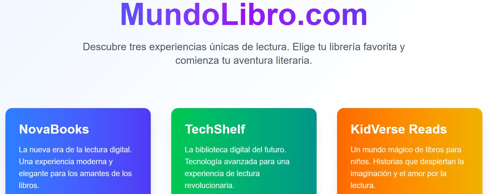
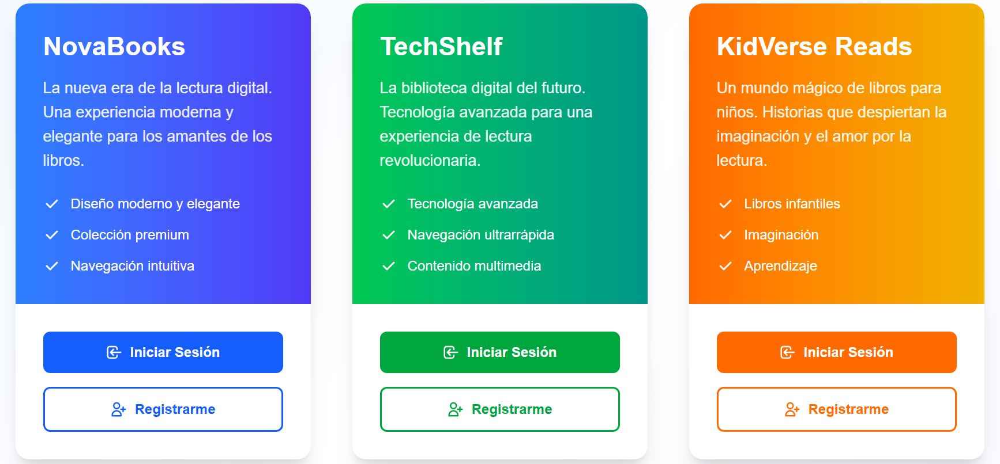
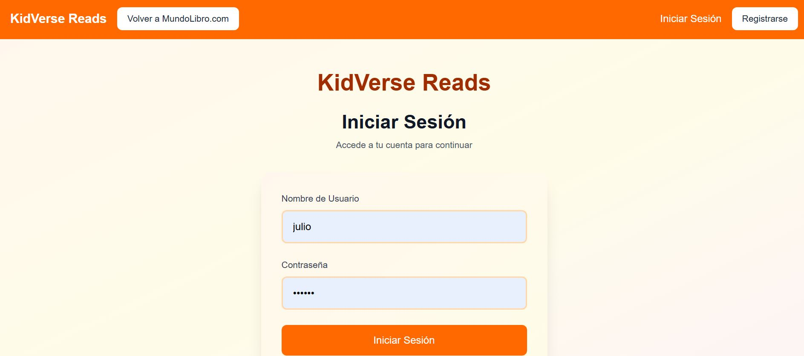
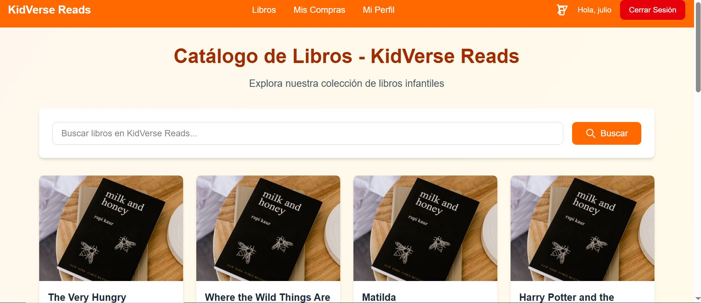
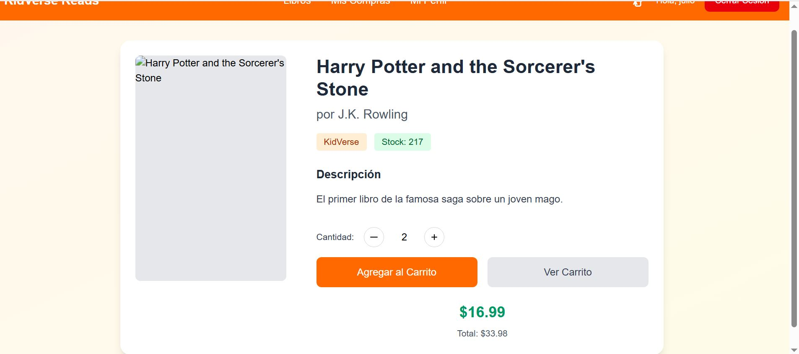
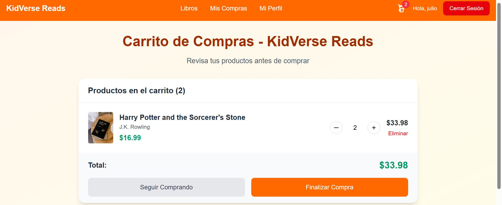
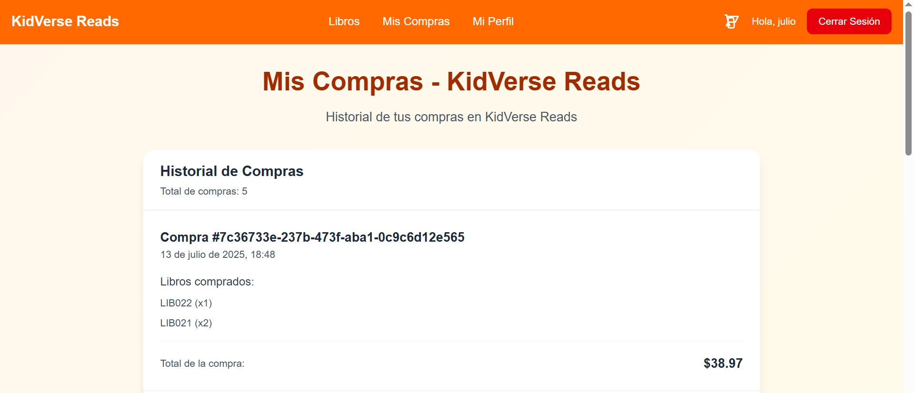

# Frontend Sistema Tienda de Libros

Link deploy: http://books-webpage-frontend-0001.s3-website-us-east-1.amazonaws.com

Sistema de biblioteca con múltiples librerías (tenants) que permite a los usuarios registrarse, iniciar sesión y comprar libros usando solo username, password y tenant_id.

## Librerías Disponibles

- **KidVerse Reads**: Librería especializada en libros infantiles
- **NovaBooks**: Librería general con amplia variedad de títulos
- **TechShelf**: Librería especializada en libros técnicos y tecnología

## Sistema de Autenticación y Compras

### API Real para Autenticación y Compras

El sistema utiliza la API real del backend para las funciones de autenticación y compras:

#### Autenticación
- **Crear Usuario**: `POST ${libreria_seleccionada}/crear`
- **Login Usuario**: `POST ${libreria_seleccionada}/login`

#### Compras
- **Registrar Compra**: `POST ${libreria_seleccionada}/registrar`
- **Listar Compras**: `POST ${libreria_seleccionada}/listar`

### Campos de Login y Registro

El sistema utiliza solo estos campos para autenticación:

```json
{
  "username": "Username_10",
  "password": "123456",
  "tenant_id": "KidVerse"
}
```

### Respuestas de la API

#### Registro (POST /crear)
```json
{
  "statusCode": 200,
  "body": {
    "message": "Usuario creado exitosamente",
    "tenant_id": "KidVerse",
    "username": "Username_10"
  }
}
```

#### Login (POST /login)
```json
{
  "statusCode": 200,
  "body": {
    "message": "Login exitoso",
    "token": "99c03722-d6fe-4739-8648-78095a6b429f",
    "expires": "2025-07-11 04:05:31",
    "tenant_id": "KidVerse",
    "username": "Username_10"
  }
}
```

#### Registrar Compra (POST /registrar)
```json
{
  "tenant_id": "KidVerse",
  "username": "Username_10",
  "items": [
    { "libro_id": "LIB001", "cantidad": 2 }
  ],
  "total": 31.47
}
```

### Características del Sistema

- **Username**: Nombre de usuario único por tenant (funciona como ID del usuario)
- **Password**: Contraseña mínima de 3 caracteres
- **Tenant ID**: Identificador automático según la librería
  - `"KidVerse"` para KidVerse Reads
  - `"NovaBooks"` para NovaBooks
  - `"TechShelf"` para TechShelf
- **Flujo de Registro**: Después del registro exitoso, el usuario debe hacer login manualmente
- **Token**: Solo se obtiene al hacer login, no al registrarse
- **API Real**: Autenticación y compras conectadas al backend real
- **Mock Data**: Resto de funcionalidades (libros, reseñas, etc.) usan datos mock
- **Sistema de Compras**: Reemplaza el sistema de préstamos anterior

### Sistema de Carrito de Compras

El sistema incluye un carrito de compras completo con las siguientes funcionalidades:

#### Funcionalidades del Carrito
- **Agregar al Carrito**: Los usuarios pueden agregar libros al carrito desde el catálogo
- **Gestión de Cantidades**: Control de cantidad por libro con límites de stock
- **Persistencia**: El carrito se guarda en localStorage y persiste entre sesiones
- **Cálculo Automático**: Total y cantidad de items calculados automáticamente
- **Validación de Stock**: No se pueden agregar más libros que el stock disponible
- **Interfaz Intuitiva**: Botones +/- para ajustar cantidades
- **Indicador Visual**: Badge en el navbar muestra cantidad de items en carrito

#### Flujo de Compra
1. **Explorar**: Usuario navega por el catálogo de libros
2. **Agregar**: Hace clic en "Agregar al Carrito" en libros de interés
3. **Gestionar**: Puede ajustar cantidades o eliminar items del carrito
4. **Revisar**: Ve el resumen de la compra con totales
5. **Comprar**: Ejecuta la compra que llama a la API real
6. **Confirmación**: Recibe confirmación y se redirige al historial

#### Componentes
- **CartContext**: Manejo de estado global del carrito
- **Cart.tsx**: Vista principal del carrito con gestión de items
- **Books.tsx**: Lista de libros con boton "Agregar al Carrito" en cada uno.
- **BookDetail.tsx**: Componente para ver la información de un libro y tiene selector de cantidad antes de agregar
- **Navbar**: Icono del carrito con contador de items

### Usuarios de Prueba

El sistema incluye usuarios de prueba predefinidos:

1. **KidVerse**: `username: "Username_10", password: "123"`
2. **NovaBooks**: `username: "JaneSmith", password: "123"`

## Capturas de Pantalla

1. Landing Inicial





2. Login



3. Catálogo de Libros





4. Carrito de Compras y Finalización de la compra






## Tecnologías Utilizadas

- React + TypeScript
- Vite
- Tailwind CSS
- React Router
- Context API para manejo de estado
- Fetch API para comunicación con backend

## Instalación y Ejecución

1. **Clonar el repositorio**
```bash
git clone <repository-url>
cd biblioteca-app
```

2. **Instalar dependencias**
```bash
npm install
```

3. **Ejecutar el proyecto**
```bash
npm run dev
```

El proyecto estará disponible en `http://localhost:5173`


## Estructura del Proyecto

```
src/
├── config/
│   └── api.ts          # Configuración de APIs
├── context/
│   ├── AuthContext.tsx # Manejo de autenticación
│   └── CartContext.tsx # Manejo del carrito de compras
├── services/
│   ├── userService.ts  # API real para auth, mock para resto
│   ├── purchaseService.ts # API real para compras
│   ├── bookService.ts  # Mock data
│   └── reviewService.ts # Mock data
├── views/
│   ├── Books.tsx       # Catálogo con botones de carrito
│   ├── BookDetail.tsx  # Detalles con selector de cantidad
│   ├── Cart.tsx        # Vista del carrito de compras
│   ├── MyPurchases.tsx # Historial de compras
│   └── UserProfile.tsx # Perfil con total gastado
└── pages/
    ├── KidVerseReads/  # Librería infantil
    ├── NovaBooks/      # Librería general
    └── TechShelf/      # Librería técnica
```

## Funcionalidades Principales

### Sistema de Carrito de Compras
- **Agregar al Carrito**: Botones en cada libro del catálogo
- **Gestión de Cantidades**: Control +/- para ajustar cantidades
- **Validación de Stock**: Límites automáticos según disponibilidad
- **Persistencia**: Carrito guardado en localStorage
- **Cálculo Automático**: Totales y contadores actualizados en tiempo real
- **Interfaz Intuitiva**: Indicadores visuales de estado del carrito

### Sistema de Compras
- **Compra desde Carrito**: Proceso de checkout desde el carrito
- **Historial de Compras**: Vista completa del historial de compras por usuario
- **Total Gastado**: Cálculo automático del total gastado en compras
- **Estado de Libros**: Cambio automático de stock tras la compra

### Navegación
- **Navbar Dinámico**: Se adapta según la librería actual
- **Icono del Carrito**: Con contador de items en el navbar
- **Enlaces de Compras**: "Mis Compras" reemplaza "Mis Préstamos"
- **Rutas Organizadas**: Separación clara por librería

### Autenticación
- **Login/Registro**: Sistema unificado por librería
- **Tokens**: Manejo automático de tokens de autenticación
- **Persistencia**: Sesiones mantenidas en localStorage

